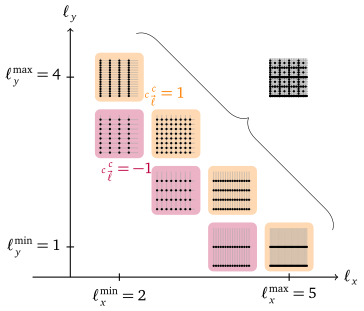

# Sparse Grid Combination Technique with Time Stepping

The sparse grid combination technique (Griebel et al.
[1992](https://ins.uni-bonn.de/media/public/publication-media/griesiam.ps.gz),
Garcke [2013](https://link.springer.com/chapter/10.1007/978-3-642-31703-3_3),
Harding [2016](https://link.springer.com/chapter/10.1007/978-3-319-28262-6_4))
can be used to alleviate the curse of dimensionality encountered in
high-dimensional problems.
Such problems are encountered as partial differential equations (PDEs)
in many fields of science and engineering.
Instead of using your PDE solver on a single structured full grid (where every
dimension is finely resolved), you would use it on many different structured
full grids (each of them differently resolved).
We call these coarsely-resolved grids component grids.
Taken together, all component grids form a sparse grid approximation, which can
be explicitly obtained by a linear superposition of the individual grid
functions, with the so-called combination coefficients.

The component grids
can be identified with their level vector $\vec{\ell} \in \mathbb{N}^d$ whose length
equals the dimensionality $d$ of the problem.
From it, one can derive the
grid's spacing $\vec{h}$ as $\vec{h} = \frac{1}{2^{\ell}}$,
assuming the domain is $[0,1)^d$.

Figure originally published in (Pollinger [2024](https://elib.uni-stuttgart.de/handle/11682/14229),
adapted from Pollinger et al. [2023](https://dl.acm.org/doi/10.1145/3581784.3607036)).

For instance, a the $x$-direction level of 5 denotes a the grid spacing in the
$x$ dimension of $h_x = \frac{1}{32}$. Assuming periodicity, this means we use 32
points in dimension $x$, like illustrated by the rightmost component grid in the
above figure.

Here, we use the truncated combination technique, which sets a minimum and maximum
level, $\vec{\ell^\text{min}}$ and $\vec{\ell^\text{max}}$, to select the
component grids $\vec{\ell} \in \mathcal{I}$.
The set of all selected component grids $\mathcal{I}$ is referred to as the
"combination scheme".
For regularity, we assume a constant difference between $\vec{\ell^\text{min}}$
and $\vec{\ell^\text{max}}$ in each dimension, but [other schemes can be useful](./advanced_topics).
<!-- The resulting component grids will be $d$ simplex "layers" in the space of 
level vectors $\vec{\ell}$. -->

One can then compute suitable combination coefficients $c_{\vec{\ell}}^c$
that are used to obtain a sparse grid function
$f_\text{SG}$ by way of a linear superposition of
functions $f_{\vec{\ell}}$ defined on the component grid:

$f_\text{SG} = \sum_{\vec{\ell} \in  \mathcal{I}} c_{\vec{\ell}}^c\cdot f_{\vec{\ell}}$

In the two-dimensional combination scheme in the above figure, all combination
coefficients are 1 and -1, respectively.
The sparse grid is illustrated on the upper right.

This sparse grid function can be expected to be accurate in
$\mathcal{O}(h^2 \cdot \log(h^{d-1}))$, given some assumptions on the bounds of
mixed-dimension partial derivatives, where $N$ is the number of points corresponding
to the finest resolution occurring in the scheme.
At the same time, the number of points is only $\mathcal{O}(d\cdot N(\log N)^{d-1})$,
drastically less than the $\mathcal{O}(N^d)$ needed for a finely-resolved full
grid.
Thus, while the gains in accuracy per degrees of freedom are the most prominent for
high dimensionalities ($d \geq 4$), even two-dimensional schemes can benefit
significantly for fine resolutions.

<!-- In the most commonly used type of combination scheme, related to "regular" sparse
grids, there are always $d$ layers -->

Between time steps, the grids exchange data through an intermediate multi-scale
represenation, which is summarized as the "combination" step in DisCoTec.
Assuming a certain smoothness in the solution, this allows for a good
approximation of the finely-resolved function, while achieving drastic
reductions in compute and memory requirements.
