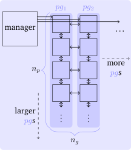

# Tutorial: Using Your Code With DisCoTec

So you want to use your timestepped simulation with the DisCoTec framework.
This Tutorial gives you an outline of the steps required.

## Your Code Interface: Init, Timestep, Get/Set Full Grid, Finish
The first step is to prepare your code in a way that it can be called by DisCoTec.
Typically, your simulation code will look similar to this (in pseudocode):

```python
int num_points_x = ...
int num_points_y = ...
int num_points_z = ...
int num_points_vx = ...
...
initial_function = ...
grid.initialize(initial_function, num_points_x, num_points_y, num_points_z, num_points_vx, ... )
helper_data_structures.initialize(...)
float end_time = ...
float time_step = ...
float time_now = 0.0;

while(time_now < end_time) { # time loop
    do_timestep(grid, time_step)
    time_now += time_step
}

properties = compute_properties(grid)
write_output(properties, grid)
```

For use with DisCoTec, we assume nestable power-of-two discretizations, i.e. where your grid spacing can be $2^{-l}$ for $l \in \mathbb{N}$.
For simplicity, in this tutorial we also assume you use periodic boundary conditions and all `num_points_` are chosen as powers of two.

You need to transform your current solver code into stateful functions, or a stateful data structure.
Let's say you introduce a class `YourSimulation`: computations before the time loop go into its constructor 
or an `init()` function (if your code uses MPI, this is also where a sub-communicator should be passed for `YourSimulation` to use).
Computation in the time loop goes into its `run()` function. 
Anything after the time loop goes into the destructor or a function `finalize()`.
Then, the following should do the same:

```diff
int num_points_x = ...
int num_points_y = ...
int num_points_z = ...
int num_points_vx = ...
...

- initial_function = ...
- grid.initialize(initial_function, num_points_x, num_points_y, num_points_z, num_points_vx, ... )
- helper_data_structures.initialize(...)
+ my_simulation = YourSimulation(num_points_x, num_points_y, num_points_z, num_points_vx, ...)
float end_time = ...
float time_step = ...
float time_now = 0.0;

while(time_now < end_time) { # time loop
-    do_timestep(grid, time_step)
+    my_simulation.run(time_step)
    time_now += time_step
}

- properties = compute_properties(grid)
- write_output(properties, grid)
+ my_simulation.finalize()
```

This setup assumes that we can pass the number of grid points per dimension in your high-d contiguous array as arguments.
In addition, you will need an interface that allows DisCoTec to get and set this data.
The most portable and memory-efficient way of doing so is to provide a pointer to the beginning of the contiguous array.
Let's call this getter `get_tensor_pointer`.

## Make Your Simulation a DisCoTec Task and Your Grid a DisCoTec DistributedFullGrid

From now on, we assume that the interface to `YourSimulation` is wrapped in a C++ header `YourSimulation.h`, roughly like this:

```cpp
#include <vector>

class YourSimulation {
 public:
  YourSimulation(int num_points_x, int num_points_y, int num_points_vx, int num_points_vy, ...);
  //...rule of 5...

  void run(double time_step);

  double* get_tensor_pointer();

  void finalize();
};
```

Now, DisCoTec comes into play. Create a new folder or project that can access both `YourSimulation` and DisCoTec.
For the combination technique, multiple instances of `YourSimulation` will be instantiated, each at different resolutions.
The `Task` class is the interface you will need to implement.
With `YourSimulation`, that will be as simple as:

```cpp
#include <memory>

// discotec includes, you may have to use a longer path here
#include "fullgrid/DistributedFullGrid.hpp"
#include "task/Task.hpp"
#include "utils/PowerOfTwo.hpp"
#include "utils/Types.hpp"

#include "YourSimulation.h"

class YourTask : public combigrid::Task {
 public:
  YourTask(combigrid::LevelVector& l, const std::vector<combigrid::BoundaryType>& boundary,
           combigrid::real coeff, combigrid::real dt)
      : Task(4, l, boundary, coeff, nullptr, nullptr), sim_(nullptr), dfg_(nullptr), dt_(dt) {}

  virtual ~YourTask(){
    if (sim_ != nullptr){
      sim_->finalize();
    }
  }

  void init(combigrid::CommunicatorType lcomm,
            const std::vector<combigrid::IndexVector>& decomposition =
                std::vector<combigrid::IndexVector>()) override {
    // DisCoTec assumes Fortran (column-major) ordering,
    // if you use C (row-major) ordering, you
    // need to assign the levels in reverse order
    const auto& l = this->getLevelVector();
    int num_points_x = combigrid::powerOfTwoByBitshift(l[0]);
    int num_points_y = combigrid::powerOfTwoByBitshift(l[1]);
    int num_points_vx = combigrid::powerOfTwoByBitshift(l[2]);
    int num_points_vy = combigrid::powerOfTwoByBitshift(l[3]);

    // this is the number of MPI processes in each dimension --
    // if all are 1, we are only using the parallelism between grids
    std::vector<int> p = {1, 1, 1, 1};

    // if using MPI within your simulation, pass p and the lcomm communicator to sim_, too
    sim_ =
        std::make_unique<YourSimulation>(num_points_x, num_points_y, num_points_vx, num_points_vy);
    // wrap tensor in a DistributedFullGrid
    dfg_ = std::make_unique<combigrid::DistributedFullGrid<combigrid::CombiDataType>>(
        this->getDim(), this->getLevelVector(), lcomm, this->getBoundary(),
        sim_->get_tensor_pointer(), p, false, decomposition);
  }

  void run(combigrid::CommunicatorType lcomm) override { sim_->run(dt_); }

  combigrid::DistributedFullGrid<combigrid::CombiDataType>& getDistributedFullGrid(
      size_t n) override {
    return *dfg_;
  }

  void setZero() override { dfg_->setZero(); }

  std::unique_ptr<YourSimulation> sim_;
  std::unique_ptr<combigrid::DistributedFullGrid<combigrid::CombiDataType>> dfg_;
  double dt_;
};
```

Note that this also turns your data into a `DistributedFullGrid`, without making a copy of the data.
DisCoTec just assumes that you pass it a pointer to a correctly-sized contiguous array.
The size of the whole "global" grid is $2^{l_d}$, with $l_d$ the level vector for each dimension $d$.
Every MPI process in your simulation should then have $2^{l_d} / p_d$ grid points, where $p$ is the cartesian process vector.


## Make Your MPI Processes Workers

Now, you can use the `YourTask` class to instantiate many tasks as part of a combination scheme.
There are a lot of choices to make regarding the combined simulation, which is why more than half 
of the example code is dedicated to defining parameters and generating input data structures:

```cpp
#include <string>
#include <vector>

// discotec includes, you may have to use a longer path here
#include "combischeme/CombiMinMaxScheme.hpp"
#include "manager/CombiParameters.hpp"
#include "manager/ProcessGroupWorker.hpp"
#include "task/Task.hpp"
#include "utils/Stats.hpp"
#include "utils/Types.hpp"

// include user task
#include "YourTask.h"

int main(int argc, char** argv) {
  static_assert(!combigrid::ENABLE_FT);  // no fault tolerance in this example
  [[maybe_unused]] auto mpiOnOff = combigrid::MpiOnOff(&argc, &argv);  // initialize MPI

  // number of process groups and number of processes per group
  const size_t ngroup = 8;
  const size_t nprocs = 1;

  // divide the MPI processes into process group and initialize the
  // corresponding communicators
  combigrid::theMPISystem()->initWorldReusable(MPI_COMM_WORLD, ngroup, nprocs, false, true);

  // input parameters
  const combigrid::DimType dim = 4;  // four-dimensional problem
  const combigrid::LevelVector lmin = {
      2, 2, 2,
      2};  // minimal level vector for each grid -> have at least 4 points in each dimension
  const combigrid::LevelVector lmax = {6, 6, 6, 6};  // maximum level vector -> level vector of target grid
  const std::vector<int> p = {
      1, 1, 1, 1};  // parallelization of domain (one process per dimension) -> must match nprocs
  const std::vector<bool> hierarchizationDims = {true, true, true,
                                                 true};  // all dimensions should be hierarchized
  const std::vector<combigrid::BoundaryType> boundary(dim,
                                                      1);  // periodic boundary in every dimension
  const combigrid::real dt = 0.01;                         // time step
  const size_t ncombi = 20;                                // number of combinations
  const std::string basis =
      "biorthogonal_periodic";  // hierarchical basis functions for intermediate representation
  const combigrid::CombinationVariant combinationVariant =
      combigrid::CombinationVariant::subspaceReduce;  // variant for data exchange between groups

  // generate combination scheme from parameters
  std::vector<combigrid::LevelVector> levels;  // level vector for each component grid
  std::vector<combigrid::real> coeffs;         // combination coefficient for each component grid
  std::vector<size_t> taskNumbers;             // only used in case of static task assignment
  {
    const auto& pgroupNumber = combigrid::theMPISystem()->getProcessGroupNumber();
    auto scheme = combigrid::CombiMinMaxScheme(dim, lmin, lmax);
    scheme.createClassicalCombischeme();
    size_t totalNumTasks = combigrid::getLoadBalancedLevels(
        scheme, pgroupNumber, combigrid::theMPISystem()->getNumGroups(), boundary, levels, coeffs,
        taskNumbers);

    MASTER_EXCLUSIVE_SECTION {
      std::cout << combigrid::getTimeStamp() << " Process group " << pgroupNumber << " will run "
                << levels.size() << " of " << totalNumTasks << " tasks." << std::endl;
    }
  }
```
These parameter values shold be suitable for a very small-scale proof-of-concept.
The last scope assigns tasks (i.e. your simulation instances) to process groups statically.

The remaining part of the code looks a lot like your initial time loop again:

```cpp
  {
    combigrid::ProcessGroupWorker worker;

    // create combiparamters
    combigrid::CombiParameters params(dim, lmin, lmax, boundary, levels, coeffs,
                                      hierarchizationDims, taskNumbers, ncombi, 1,
                                      combinationVariant);
    setCombiParametersHierarchicalBasesUniform(params, basis);
    params.setParallelization(p);
    worker.setCombiParameters(std::move(params));

    // initialize individual tasks (component grids)
    for (size_t i = 0; i < levels.size(); i++) {
      worker.initializeTask(
          std::unique_ptr<combigrid::Task>(new YourTask(levels[i], boundary, coeffs[i], dt)));
    }

    worker.initCombinedDSGVector();
    worker.zeroDsgsData();  // initialize sparse grid data structures

    for (size_t i = 0; i < ncombi; ++i) {
      // run tasks for next time interval
      worker.runAllTasks();
      worker.combineAtOnce();
    }

    MIDDLE_PROCESS_EXCLUSIVE_SECTION {
      std::cout << combigrid::getTimeStamp() << " Performed " << ncombi << " combinations."
                << std::endl;
    }
  }
  return 0;
}
```
Instantiating a `ProcessGroupWorker` at the beginning of the scope sets up some data structures,
in particular a `TaskWorker` and a `SparseGridWorker`.
Coming back to the [parallelism in DisCoTec](./parallelism.md):



The `TaskWorker` deals with the task execution and other within-group operations (vertical in the graphics), while the 
`SparseGridWorker` handles the operations across groups, such as the reduction in the combination (horizontal in the graphics).
The `ProcessGroupWorker` bundles the two and adds abstracts functions required for further control hierarchies.
If you want to add further functionality to DisCoTec, this would be a typical extension point. Otherwise, it's just where functions are encapsulated for you to use!


## Combine!

Compile the code using your familiar build tools. MPI and DisCoTec should be the only immediate dependencies.

```sh
$ mpiexec -n 8 ./tutorial_example 
MPI: 8 groups with 1 ranks each with 1 threads each and 1-fold nested parallelism; without world manager
[20240912T133902]  Process group 5 will run 5 of 35 tasks.
[20240912T133902]  Process group 7 will run 4 of 35 tasks.
[20240912T133902]  Process group 4 will run 5 of 35 tasks.
[20240912T133902]  Process group 6 will run 5 of 35 tasks.
[20240912T133902]  Process group 0 will run 4 of 35 tasks.
[20240912T133902]  Process group 2 will run 4 of 35 tasks.
[20240912T133902]  Process group 3 will run 4 of 35 tasks.
[20240912T133902]  Process group 1 will run 4 of 35 tasks.
Found max. 7 different communicators for subspaces
[20240912T133902]  Performed 20 combinations.
```

Depending on your use case, now you need to evaluate: are the results "good" (in your own metric)?
You can evaluate this, for instance, by Monte-Carlo integration of the error compared to a reference 
solution ([example here](https://github.com/SGpp/DisCoTec/blob/main/examples/combi_workers_only/combi_example_worker_only.cpp#L141)), 
or by combining output files as a postprocessing step ([example here](https://github.com/SGpp/DisCoTec/blob/main/examples/selalib_distributed/postprocessing/combine_selalib_diagnostics.cpp#L38)).

This is your starting point for playing with the combination technique:
- How do the minimum and maximum resolution affect the results?
- Can you see a difference when using different hierarchical basis functions?
- Can you do multiple time steps per combination? Do you have to combine at all to get the required accuracy?
 
If you need to go to a larger scale or want to further customize the combination behavior, 
keep reading on about [advanced topics](./advanced_topics.md).
